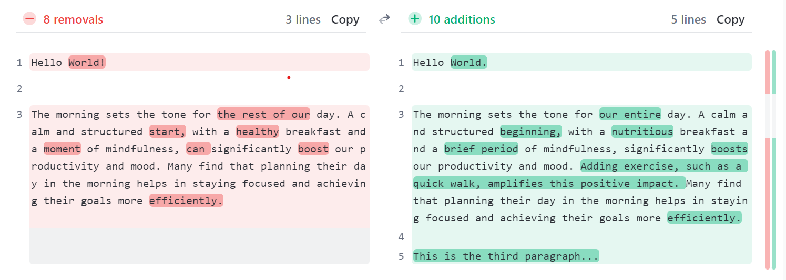
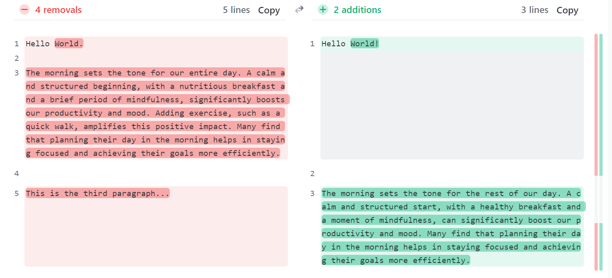

# Text-Diff-NLP Tool
A text comparison tool powered by NLP

## Motivation 
Traditional diff tools often lack context sensitivity. They might highlight differences line by line or based on simple textual changes without understanding the context of the change.  

1. When the first sentence in the paragraoh changes significantly, the tool might lose its "alignment" between the two versions being compared. This misalignment can cause the tool to incorrectly match lines or blocks of text further down the document, leading to a cascade of perceived differences that do not accurately reflect the actual changes made.

Here is an example. Switching the original and edited texts cause completely different result.

text1 :
Hello World!

The morning sets the tone for the rest of our day. A calm and structured start, with a healthy breakfast and a moment of mindfulness, can significantly boost our productivity and mood. Many find that planning their day in the morning helps in staying focused and achieving their goals more efficiently.

text2:
Hello World.

The morning sets the tone for our entire day. A calm and structured beginning, with a nutritious breakfast and a brief period of mindfulness, significantly boosts our productivity and mood. Adding exercise, such as a quick walk, amplifies this positive impact. Many find that planning their day in the morning helps in staying focused and achieving their goals more efficiently.

This is the third paragraph...

For example, rearranging paragraphs in a document might be shown as a large deletion followed by an addition, instead of a simple move.

