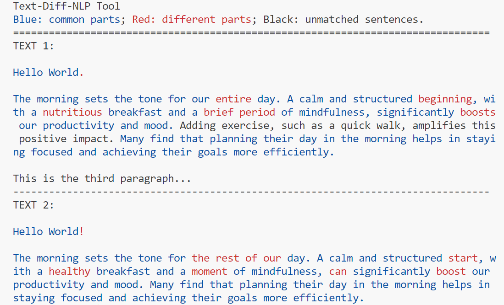

# Text-Diff-NLP Tool
A text comparison tool powered by NLP.

## Usage
Compare two texts and highlight differences (e.g., word, sentence, or paragraph addition/deletion). However, sentence or paragraph reordering should not be considered "same".

## Motivation 
Traditional diff tools often require the original and edited texts to have the same structure/order. When the structure/order differs, the algorithm marks the whole text as different. To overcome this, instead of comparing the whole text, we compare pairs of similar sentences.

## How it works
1. Split the sentences with NLP algorithms instead of splitting by punctuation.
2. Find similar sentence pairs with semantic similarity measurement.
3. Perform text-diff algorithm on each pair of similar sentences.
4. Highlight the differences.

## Sample example

## Installation
To install the Text-Diff-NLP Tool, follow these steps:
1. Clone this repository.
2. Install the required Python packages using pip: run `pip install -r requirement.txt`.
3. Download the spaCy English language model: `python -m spacy download en_core_web_sm`.
4. Run `python main.py`.

